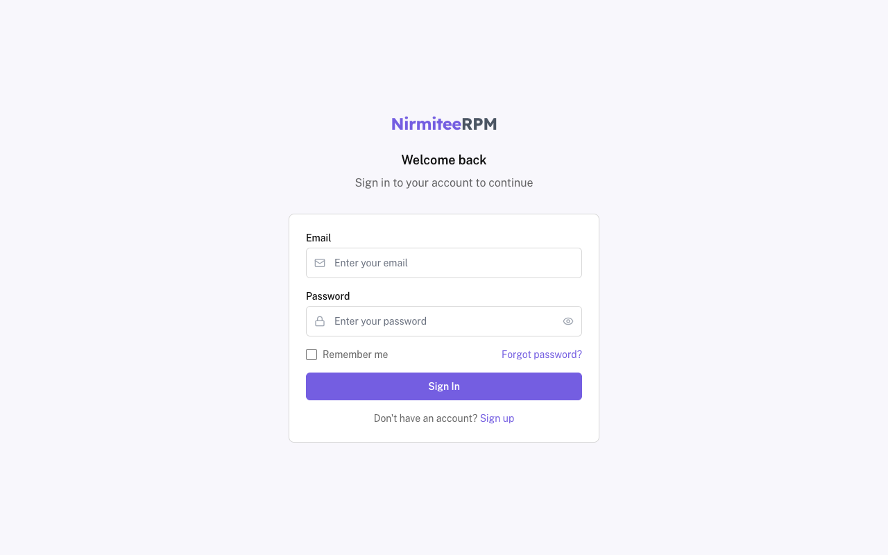
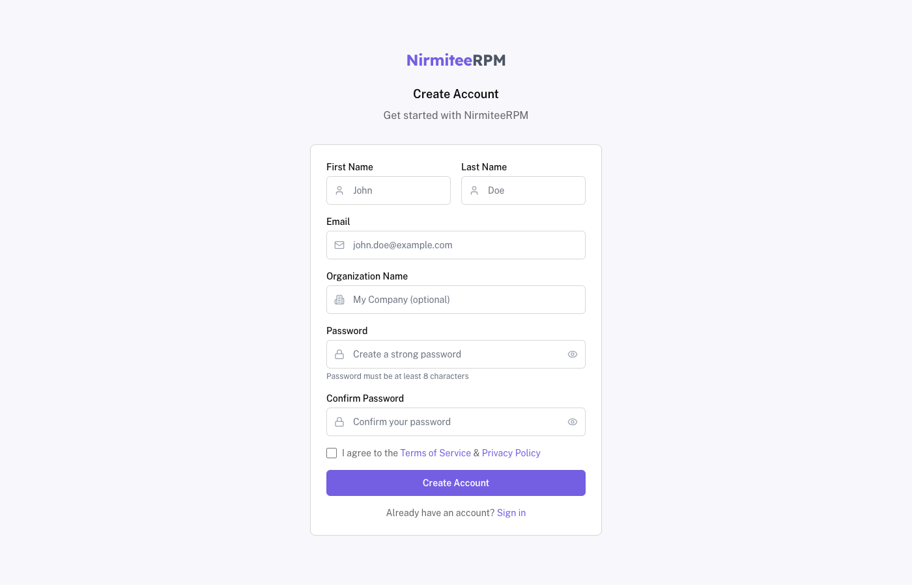
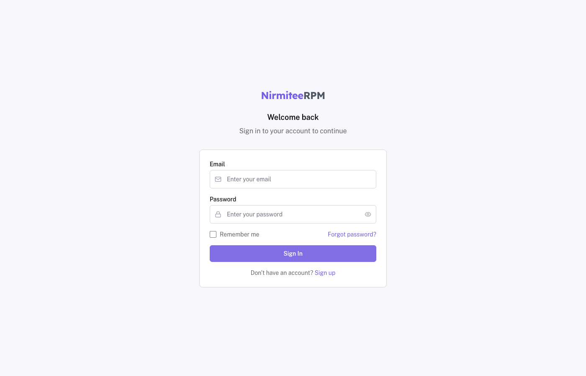
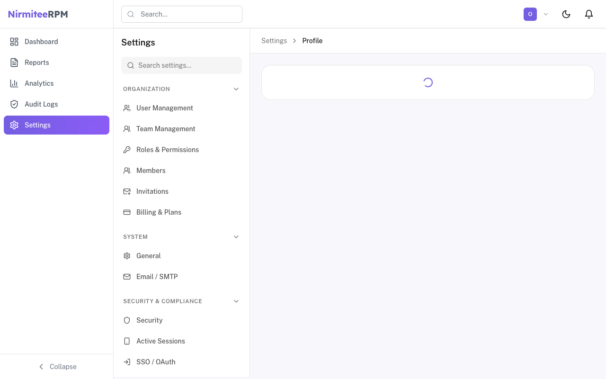
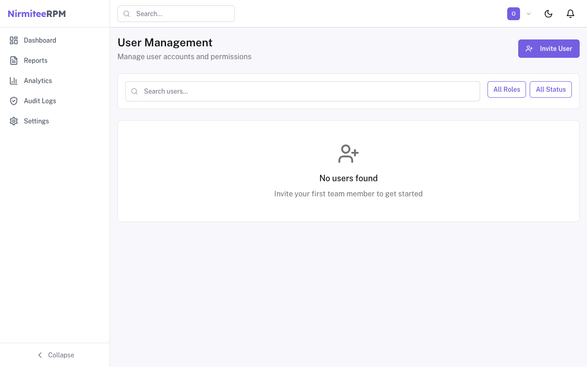
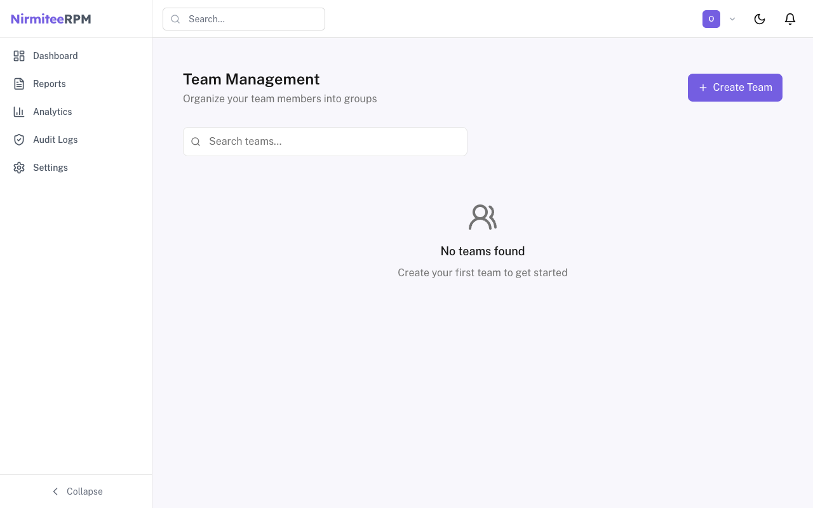
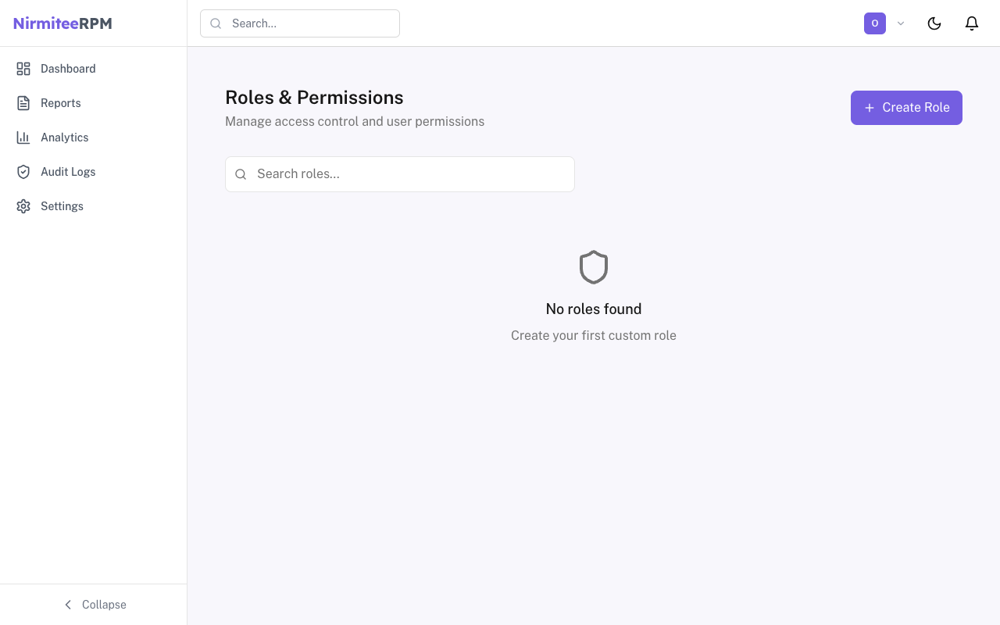
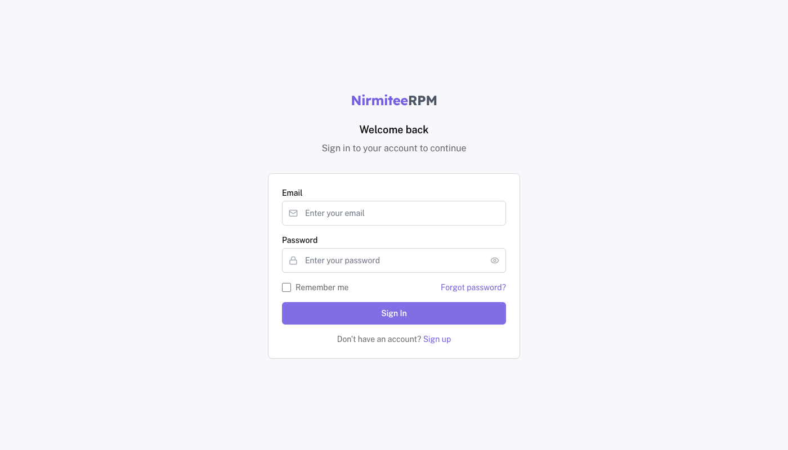
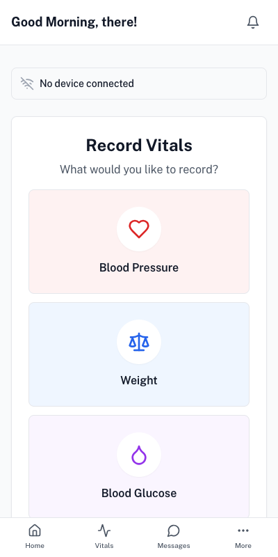

# NirmiteeRPM

**Open Source Remote Patient Monitoring System**

A comprehensive, full-featured Remote Patient Monitoring (RPM) platform designed for healthcare providers to monitor patients remotely, track vital signs, manage care plans, and improve patient outcomes.

## Vision

NirmiteeRPM aims to be the leading open-source RPM solution, providing healthcare organizations with a secure, scalable, and fully integrated platform for remote patient care management.

## Key Features

### Core RPM Capabilities (Planned)
- **Patient Monitoring Dashboard** - Real-time vital signs tracking and alerts
- **Device Integrations** - Support for various medical devices and wearables
- **Care Plan Management** - Create and manage personalized patient care plans
- **Alerts & Notifications** - Configurable thresholds and escalation workflows
- **Telehealth Integration** - Video consultations and messaging
- **Analytics & Reporting** - Patient trends, outcomes, and compliance reports

### Platform Features (Implemented)
- **Multi-Tenant Architecture** - Organization/workspace support for clinics and hospitals
- **Authentication & Security** - JWT-based auth with OAuth (Google, Microsoft SSO)
- **Role-Based Access Control** - Granular permissions for healthcare teams
- **User & Team Management** - Manage staff, roles, and team assignments
- **Audit Logging** - Complete audit trail for compliance (HIPAA-ready)
- **Real-time Notifications** - WebSocket-based live updates
- **Internationalization** - Multi-language support (English, Hindi)
- **Dark Mode** - Accessible UI with theme support

## Screenshots

### Authentication Pages

| Login | Sign Up |
|:-----:|:-------:|
|  |  |

### Dashboard & Management

| Dashboard | Settings |
|:---------:|:--------:|
|  |  |

### User & Team Management

| Users | Teams |
|:-----:|:-----:|
|  |  |

### Roles & Permissions

| Roles Management |
|:----------------:|
|  |

### Patient Management

| Patients List | Patient Detail |
|:-------------:|:--------------:|
|  |  |

### Patient Detail Features

The Patient Detail page provides a comprehensive clinical dashboard:

| Feature | Description |
|---------|-------------|
| **Patient Header** | Demographics, MRN, contact info, quick actions |
| **Conditions Card** | Active diagnoses with ICD codes |
| **Devices Card** | Assigned RPM devices (BP monitor, glucometer, scale) |
| **Care Team Card** | Assigned physician and care manager |
| **Time Logging** | Track patient interaction time with animated timer |
| **Vitals Dashboard** | Multi-tab interface (Vitals, Care Management, Health Records, Assessment, Alerts, Billing, Devices, Documents) |
| **Vitals Chart** | Interactive Recharts visualization with color-coded zones (Normal/Warning/Critical) |
| **Statistical Insights** | Latest, average, min/max values with trend indicators |
| **Quick Summary** | Reading counts, status distribution, last updated timestamp |

### Vitals Recording

| Record Vitals |
|:-------------:|
|  |

## Tech Stack

| Layer | Technology |
|-------|------------|
| **Frontend** | Next.js 14 (App Router), React 18, TypeScript |
| **Backend** | Node.js, Express, TypeScript |
| **Database** | PostgreSQL with Prisma ORM |
| **Auth** | JWT (Access + Refresh Tokens), OAuth 2.0 |
| **Real-time** | WebSockets (Socket.io) |
| **Styling** | Tailwind CSS, CVA, Lucide Icons |
| **Package Manager** | pnpm (monorepo with workspaces) |
| **Infrastructure** | Docker, Docker Compose |

## Project Structure

```
NirmiteeRPM/
├── apps/
│   ├── web/                 # Next.js frontend application
│   │   ├── app/             # App Router pages & layouts
│   │   ├── components/      # React components
│   │   ├── lib/             # API clients, auth, utilities
│   │   ├── messages/        # i18n translations (en, hi)
│   │   └── i18n/            # Internationalization config
│   └── api/                 # Express.js backend API
│       ├── src/
│       │   ├── routes/      # API route handlers
│       │   ├── services/    # Business logic
│       │   ├── middleware/  # Auth, logging, error handling
│       │   └── utils/       # Helpers (JWT, password, etc.)
│       └── prisma/          # Database schema & migrations
├── packages/
│   ├── ui/                  # Shared UI component library
│   ├── types/               # Shared TypeScript types
│   └── config/              # Shared configs (Tailwind, TS, ESLint)
├── docker/                  # Dockerfiles for services
└── docs/                    # Documentation
```

## Getting Started

### Prerequisites

- Node.js 20+
- pnpm 8+
- PostgreSQL 15+ (or use Docker)
- Docker & Docker Compose (optional)

### Installation

```bash
# Clone the repository
git clone https://github.com/your-org/NirmiteeRPM.git
cd NirmiteeRPM

# Install dependencies
pnpm install

# Set up environment variables
cp apps/api/.env.example apps/api/.env
cp apps/web/.env.example apps/web/.env

# Run database migrations
cd apps/api && pnpm prisma migrate dev

# Seed the database (optional)
pnpm prisma db seed

# Start development servers
pnpm dev
```

### Development Commands

```bash
# Start all services (frontend + backend)
pnpm dev

# Start individual services
pnpm --filter web dev      # Frontend only (localhost:3000)
pnpm --filter api dev      # Backend only (localhost:4000)

# Build for production
pnpm build

# Type checking
pnpm type-check

# Linting
pnpm lint

# Database commands
pnpm --filter api prisma studio    # Open Prisma Studio
pnpm --filter api prisma migrate   # Run migrations

# Clean build artifacts
pnpm clean
```

### Docker

```bash
# Start all services with Docker
pnpm docker:up

# Stop all services
pnpm docker:down

# Rebuild containers
pnpm docker:build
```

## API Endpoints

| Endpoint | Method | Description |
|----------|--------|-------------|
| `/api/auth/login` | POST | User login |
| `/api/auth/signup` | POST | User registration |
| `/api/auth/refresh` | POST | Refresh access token |
| `/api/oauth/providers` | GET | List OAuth providers |
| `/api/users` | GET | List organization users |
| `/api/teams` | GET | List teams |
| `/api/roles` | GET | List roles & permissions |
| `/api/organizations` | GET/POST | Manage organizations |
| `/api/notifications` | GET | User notifications |
| `/api/audit` | GET | Audit logs |
| `/api/patients` | GET/POST | List & create patients |
| `/api/patients/:id` | GET/PATCH | Get & update patient |
| `/api/patients/search` | GET | Quick patient search |
| `/api/patients/drafts` | GET/POST/DELETE | Enrollment draft management |
| `/api/patients/:id/enrollment-status` | PATCH | Update enrollment status |
| `/api/patients/:id/care-team` | POST | Assign care team |
| `/api/vitals/readings` | GET/POST | List & record vital readings |
| `/api/vitals/readings/:id` | GET/PATCH/DELETE | Manage vital reading |

## Roadmap

### Phase 1: Foundation (Current)
- [x] Multi-tenant authentication system
- [x] OAuth integration (Google, Microsoft)
- [x] Role-based access control
- [x] User & team management
- [x] Organization/workspace management
- [x] Audit logging
- [x] Internationalization (i18n)

### Phase 2: Patient Management (Current)
- [x] Patient registration & enrollment wizard
- [x] Patient demographics & medical history
- [x] Care team assignments
- [x] Patient search & filtering
- [x] Enrollment status workflow (Pending → Consented → Active)
- [x] Enrollment draft saving
- [x] Patient detail page with quick actions
- [x] Vitals recording interface

### Phase 3: Device Integration
- [ ] Device registry & management
- [ ] Vital signs data ingestion APIs
- [ ] Support for common RPM devices
- [ ] HL7 FHIR integration

### Phase 4: Monitoring & Alerts
- [ ] Real-time vital signs dashboard
- [ ] Configurable alert thresholds
- [ ] Escalation workflows
- [ ] SMS/Email notifications

### Phase 5: Telehealth & Communication
- [ ] Video consultation integration
- [ ] Secure messaging
- [ ] Care plan sharing with patients

### Phase 6: Analytics & Compliance
- [ ] Patient outcome analytics
- [ ] Population health dashboards
- [ ] HIPAA compliance tools
- [ ] Export & reporting

## Contributing

We welcome contributions! Please see our [Contributing Guide](CONTRIBUTING.md) for details.

1. Fork the repository
2. Create a feature branch (`git checkout -b feature/amazing-feature`)
3. Commit your changes (`git commit -m 'Add amazing feature'`)
4. Push to the branch (`git push origin feature/amazing-feature`)
5. Open a Pull Request

## Security

This project is designed with healthcare security requirements in mind:

- JWT-based authentication with short-lived access tokens
- Refresh token rotation
- Password hashing with bcrypt
- CORS protection
- Rate limiting
- Audit logging for all actions
- Role-based access control

For security concerns, please email security@nirmitee.io (or open a private issue).

## License

This project is licensed under the **MIT License** - see the [LICENSE](LICENSE) file for details.

Open source and free to use for healthcare organizations worldwide.

---

**Built with care for better patient outcomes.**
