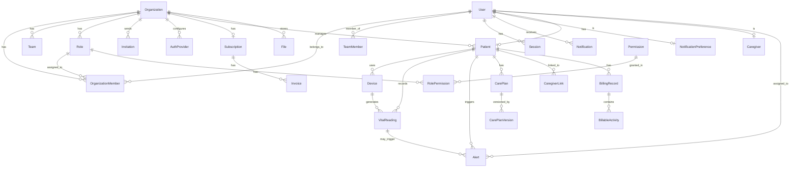

# Database Schema Documentation

## Overview
NirmiteeRPM uses PostgreSQL 15+ with Prisma ORM for type-safe database access. Multi-tenant architecture with `organizationId` on all tenant-scoped tables.

## Entity Relationship Diagram



## Core Tables

### Organization
Multi-tenant root entity. All other tenant data scoped to organization.

| Column | Type | Description |
|--------|------|-------------|
| id | String | Primary key (cuid) |
| name | String | Organization name |
| slug | String | Unique URL-safe identifier |
| logo | String? | Logo URL |
| settings | Json | Organization settings |
| deletedAt | DateTime? | Soft delete timestamp |
| createdAt | DateTime | Creation timestamp |
| updatedAt | DateTime | Last update timestamp |

**Indexes**: `slug`, `deletedAt`

**Relationships**:
- Has many: OrganizationMember, Team, Role, Invitation, AuthProvider, Patient, File
- Has one: Subscription

---

### User
User accounts with authentication credentials.

| Column | Type | Description |
|--------|------|-------------|
| id | String | Primary key (cuid) |
| email | String | Unique email address |
| passwordHash | String? | Bcrypt password (null for OAuth-only) |
| firstName | String | First name |
| lastName | String | Last name |
| avatar | String? | Avatar URL |
| emailVerified | Boolean | Email verification status |
| isActive | Boolean | Account active status |
| mfaEnabled | Boolean | MFA enabled flag |
| mfaMethod | Enum? | TOTP or EMAIL |
| mfaSecret | String? | TOTP secret (encrypted) |
| mfaBackupCodes | String[] | Hashed backup codes |
| deletedAt | DateTime? | Soft delete timestamp |
| lastLoginAt | DateTime? | Last login timestamp |
| createdAt | DateTime | Creation timestamp |
| updatedAt | DateTime | Last update timestamp |

**Indexes**: `email`, `isActive`, `deletedAt`, `createdAt`

**Relationships**:
- Has many: OrganizationMember, TeamMember, Session, Notification
- Has one: Patient, Caregiver, NotificationPreference

---

### OrganizationMember
Junction table linking users to organizations with roles.

| Column | Type | Description |
|--------|------|-------------|
| id | String | Primary key (cuid) |
| userId | String | Foreign key to User |
| organizationId | String | Foreign key to Organization |
| roleId | String | Foreign key to Role |
| status | Enum | ACTIVE, INACTIVE, SUSPENDED |
| joinedAt | DateTime | Join timestamp |
| updatedAt | DateTime | Last update timestamp |

**Indexes**: `organizationId`, `roleId`, `status`, `[userId + organizationId]` (unique)

---

### Role & Permission (RBAC)
Role-based access control system.

#### Role
| Column | Type | Description |
|--------|------|-------------|
| id | String | Primary key (cuid) |
| name | String | Role name |
| description | String? | Role description |
| organizationId | String? | null = system role |
| isSystem | Boolean | System vs custom role |
| createdAt | DateTime | Creation timestamp |
| updatedAt | DateTime | Last update timestamp |

**System Roles**: Owner, Admin, Member (organizationId = null)
**Custom Roles**: Organization-specific (organizationId set)

#### Permission
| Column | Type | Description |
|--------|------|-------------|
| id | String | Primary key (cuid) |
| code | String | Unique code (e.g., "users:read") |
| name | String | Display name |
| description | String? | Permission description |
| module | String | Module (users, teams, patients) |
| action | String | Action (read, write, delete, manage) |
| createdAt | DateTime | Creation timestamp |

**Indexes**: `code` (unique), `module`, `action`

#### RolePermission
Junction table linking roles to permissions.

| Column | Type | Description |
|--------|------|-------------|
| id | String | Primary key (cuid) |
| roleId | String | Foreign key to Role |
| permissionId | String | Foreign key to Permission |

**Indexes**: `[roleId + permissionId]` (unique)

---

### Session
User sessions for JWT refresh tokens.

| Column | Type | Description |
|--------|------|-------------|
| id | String | Primary key (cuid) |
| userId | String | Foreign key to User |
| token | String | Refresh token (hashed) |
| userAgent | String? | Client user agent |
| ipAddress | String? | Client IP address |
| expiresAt | DateTime | Expiration timestamp |
| createdAt | DateTime | Creation timestamp |

**Indexes**: `userId`, `token` (unique), `expiresAt`

---

### AuthProvider
OAuth/SSO provider configurations.

| Column | Type | Description |
|--------|------|-------------|
| id | String | Primary key (cuid) |
| organizationId | String? | null = global, else org-specific |
| provider | Enum | GOOGLE, MICROSOFT, GITHUB, etc. |
| name | String | Display name |
| clientId | String | OAuth client ID |
| clientSecret | String | OAuth client secret (encrypted) |
| tenantId | String? | For Microsoft/Azure AD |
| domain | String? | For Google Workspace restriction |
| enabled | Boolean | Provider enabled status |
| autoProvision | Boolean | Auto-create users on first login |
| defaultRoleId | String? | Role for auto-provisioned users |
| settings | Json | Provider-specific settings |
| createdAt | DateTime | Creation timestamp |
| updatedAt | DateTime | Last update timestamp |

**Indexes**: `[organizationId + provider]` (unique), `provider`, `enabled`

---

## RPM-Specific Tables

### Patient
Patient enrollment and demographics.

| Column | Type | Description |
|--------|------|-------------|
| id | String | Primary key (cuid) |
| userId | String | Foreign key to User (unique) |
| organizationId | String | Multi-tenant RLS |
| dateOfBirth | DateTime | Patient DOB |
| phone | String? | Contact phone |
| address | Json? | Address object |
| conditions | Enum[] | Array of PatientCondition |
| insuranceProvider | String? | Insurance provider name |
| insurancePolicyNumber | String? | Policy number |
| enrollmentStatus | Enum | PENDING, ACTIVE, PAUSED, DISCHARGED |
| enrollmentDate | DateTime? | Enrollment date |
| primaryPhysicianId | String? | Assigned physician |
| assignedClinicalStaffId | String? | Assigned staff |
| deletedAt | DateTime? | Soft delete timestamp |
| createdAt | DateTime | Creation timestamp |
| updatedAt | DateTime | Last update timestamp |

**Indexes**: `organizationId`, `userId`, `enrollmentStatus`, `deletedAt`, `[organizationId + enrollmentStatus]`

---

### Device
Medical devices assigned to patients.

| Column | Type | Description |
|--------|------|-------------|
| id | String | Primary key (cuid) |
| patientId | String | Foreign key to Patient |
| organizationId | String | Multi-tenant RLS |
| type | Enum | Device type (BP monitor, scale, etc.) |
| serialNumber | String | Unique serial number |
| manufacturer | String? | Device manufacturer |
| model | String? | Device model |
| status | Enum | ACTIVE, INACTIVE, MALFUNCTIONING, DECOMMISSIONED |
| lastSyncAt | DateTime? | Last sync timestamp |
| assignedAt | DateTime | Assignment timestamp |
| createdAt | DateTime | Creation timestamp |
| updatedAt | DateTime | Last update timestamp |

**Indexes**: `serialNumber` (unique), `patientId`, `organizationId`, `type`, `status`, `[organizationId + patientId]`

---

### VitalReading
Vital signs data from devices or manual entry.

| Column | Type | Description |
|--------|------|-------------|
| id | String | Primary key (cuid) |
| patientId | String | Foreign key to Patient |
| organizationId | String | Multi-tenant RLS |
| deviceId | String? | Foreign key to Device (null if manual) |
| type | Enum | BLOOD_PRESSURE, WEIGHT, GLUCOSE, etc. |
| values | Json | Reading values (type-specific structure) |
| unit | String | Unit of measurement |
| source | Enum | DEVICE, MANUAL, EHR_IMPORT, CAREGIVER_ENTRY |
| recordedAt | DateTime | When reading was taken |
| receivedAt | DateTime | When system received reading |
| notes | String? | Optional notes |
| createdAt | DateTime | Creation timestamp |

**Indexes**: `patientId`, `organizationId`, `type`, `recordedAt`, `deviceId`, `[patientId + recordedAt]`, `[organizationId + recordedAt]`, `[patientId + type + recordedAt]`

**Values Examples**:
```json
// Blood Pressure
{ "systolic": 140, "diastolic": 90, "pulse": 72 }

// Weight
{ "weight": 82.5, "bmi": 28.3 }

// Blood Glucose
{ "glucose": 145, "testType": "fasting" }
```

---

### Alert
Alerts generated from vital readings or system events.

| Column | Type | Description |
|--------|------|-------------|
| id | String | Primary key (cuid) |
| patientId | String | Foreign key to Patient |
| organizationId | String | Multi-tenant RLS |
| vitalReadingId | String? | Triggering vital reading |
| type | Enum | Alert type (threshold exceeded, etc.) |
| severity | Enum | CRITICAL, SIGNIFICANT, INFORMATIONAL |
| status | Enum | NEW, ACKNOWLEDGED, ESCALATED, RESOLVED, DISMISSED |
| message | String | Alert message |
| metadata | Json? | Additional context |
| assignedToId | String? | Assigned clinical staff |
| escalatedToId | String? | Escalated to physician |
| acknowledgedById | String? | Who acknowledged |
| acknowledgedAt | DateTime? | Acknowledgment timestamp |
| escalatedAt | DateTime? | Escalation timestamp |
| resolvedAt | DateTime? | Resolution timestamp |
| resolution | String? | Resolution notes |
| createdAt | DateTime | Creation timestamp |
| updatedAt | DateTime | Last update timestamp |

**Indexes**: `patientId`, `organizationId`, `severity`, `status`, `type`, `assignedToId`, `escalatedToId`, `createdAt`, `[organizationId + status]`, `[patientId + status]`, `[assignedToId + status]`

---

### CarePlan & CarePlanVersion
Versioned care plans for patients.

#### CarePlan
| Column | Type | Description |
|--------|------|-------------|
| id | String | Primary key (cuid) |
| patientId | String | Foreign key to Patient |
| organizationId | String | Multi-tenant RLS |
| createdById | String | User who created |
| approvedById | String? | Physician who approved |
| currentVersion | Int | Current version number |
| status | Enum | DRAFT, ACTIVE, PAUSED, COMPLETED, CANCELLED |
| activatedAt | DateTime? | Activation timestamp |
| deactivatedAt | DateTime? | Deactivation timestamp |
| createdAt | DateTime | Creation timestamp |
| updatedAt | DateTime | Last update timestamp |

#### CarePlanVersion
| Column | Type | Description |
|--------|------|-------------|
| id | String | Primary key (cuid) |
| carePlanId | String | Foreign key to CarePlan |
| organizationId | String | Multi-tenant RLS |
| version | Int | Version number |
| goals | Json | Array of care goals |
| vitalThresholds | Json | Thresholds per vital type |
| medications | Json? | Medication list |
| instructions | String? | Care instructions |
| effectiveDate | DateTime | Effective date |
| expiryDate | DateTime? | Expiry date |
| createdAt | DateTime | Creation timestamp |

---

### BillingRecord & BillableActivity
CPT code tracking for insurance billing.

#### BillingRecord
| Column | Type | Description |
|--------|------|-------------|
| id | String | Primary key (cuid) |
| patientId | String | Foreign key to Patient |
| organizationId | String | Multi-tenant RLS |
| periodStart | DateTime | Billing period start |
| periodEnd | DateTime | Billing period end |
| dataTransmissionDays | Int | Days with data transmission |
| interactionMinutes | Int | Clinical interaction minutes |
| status | Enum | PENDING, ELIGIBLE, SUBMITTED, ACCEPTED, DENIED, PAID, APPEALED |
| claimId | String? | Insurance claim ID |
| claimSubmittedAt | DateTime? | Claim submission timestamp |
| paidAt | DateTime? | Payment timestamp |
| amount | Float? | Payment amount |
| notes | String? | Billing notes |
| createdAt | DateTime | Creation timestamp |
| updatedAt | DateTime | Last update timestamp |

#### BillableActivity
| Column | Type | Description |
|--------|------|-------------|
| id | String | Primary key (cuid) |
| billingRecordId | String | Foreign key to BillingRecord |
| organizationId | String | Multi-tenant RLS |
| cptCode | Enum | CPT code (99453, 99454, 99457, etc.) |
| performedById | String | User who performed activity |
| performedAt | DateTime | Performance timestamp |
| durationMinutes | Int? | Duration (for time-based codes) |
| description | String? | Activity description |
| metadata | Json? | Additional metadata |
| createdAt | DateTime | Creation timestamp |

---

## Supporting Tables

### Notification
User notifications.

| Column | Type | Description |
|--------|------|-------------|
| id | String | Primary key (cuid) |
| userId | String | Foreign key to User |
| organizationId | String? | Org context |
| type | Enum | Notification type |
| title | String | Notification title |
| message | String | Notification message |
| data | Json? | Additional data |
| isRead | Boolean | Read status |
| readAt | DateTime? | Read timestamp |
| createdAt | DateTime | Creation timestamp |

**Indexes**: `userId`, `[userId + isRead]`, `organizationId`, `type`, `createdAt`

---

### Activity
Activity feed for user-friendly timeline.

| Column | Type | Description |
|--------|------|-------------|
| id | String | Primary key (cuid) |
| organizationId | String | Multi-tenant RLS |
| actorId | String | User who performed action |
| actorType | Enum | USER, SYSTEM, API |
| action | String | Action (created, updated, deleted) |
| entityType | String | Entity (user, team, patient, alert) |
| entityId | String | Entity ID |
| entityName | String? | Display name |
| metadata | Json? | Additional context |
| createdAt | DateTime | Creation timestamp |

**Indexes**: `[organizationId + createdAt]`, `[entityType + entityId]`, `actorId`, `[actorId + createdAt]`, `[organizationId + entityType + createdAt]`

---

### AuditLog
Detailed audit trail for compliance.

| Column | Type | Description |
|--------|------|-------------|
| id | String | Primary key (cuid) |
| userId | String? | User who performed action |
| organizationId | String? | Org context |
| action | String | Action (user.created, role.updated) |
| entity | String | Entity type |
| entityId | String? | Entity ID |
| oldValues | Json? | Previous state |
| newValues | Json? | New state |
| metadata | Json? | Additional context |
| ipAddress | String? | Client IP |
| userAgent | String? | Client user agent |
| createdAt | DateTime | Creation timestamp |

**Indexes**: `userId`, `organizationId`, `action`, `entity`, `entityId`, `createdAt`, `[organizationId + createdAt]`

---

## Migration Guide

### Running Migrations
```bash
# Development
pnpm --filter api prisma migrate dev --name descriptive_name

# Production
pnpm --filter api prisma migrate deploy
```

### Migration File Location
```
apps/api/prisma/migrations/
├── 20260106115959_init/
│   └── migration.sql
├── 20260106123808_add_oauth_providers/
│   └── migration.sql
└── migration_lock.toml
```

### Rollback Strategy
Prisma doesn't support automatic rollbacks. Manual rollback:
1. Restore database from backup
2. Or write reverse migration SQL manually

### Best Practices
- Always test migrations on dev/staging first
- Keep migrations small and focused
- Include both up and down migration logic (manual)
- Backup database before production migrations
- Monitor migration duration for large tables

---

## Indexing Strategy

### Multi-Tenant Indexes
All tenant tables have `organizationId` index:
```prisma
@@index([organizationId])
```

### Compound Indexes
Common query patterns get compound indexes:
```prisma
@@index([organizationId, createdAt])
@@index([patientId, recordedAt])
@@index([organizationId, status])
```

### Foreign Key Indexes
All foreign keys indexed for join performance:
```prisma
@@index([userId])
@@index([roleId])
@@index([patientId])
```

### Query Optimization
- Use `select` to fetch only needed fields
- Use `include` judiciously (avoid N+1)
- Batch queries with `Promise.all()`
- Use raw SQL for complex analytics

---

## Data Retention

### Soft Deletes
Critical records use soft deletes:
- Organization, User, Team, Patient, File

Query pattern:
```typescript
where: {
  organizationId,
  deletedAt: null
}
```

### Hard Deletes
Transient data uses hard deletes:
- Session, PasswordReset, Invitation (after expiry)

### Audit Data Retention
- AuditLog: Retain 7 years (compliance)
- Activity: Retain 1 year
- Notification: Retain 90 days

---

## Backup Strategy

### Automated Backups
- Daily full backup with `pg_dump`
- Point-in-time recovery with WAL archiving
- Backup retention: 30 days
- Off-site backup storage (S3)

### Restore Testing
- Monthly restore tests to verify backups
- Automated restore to staging environment
- Document restore procedures

### Disaster Recovery
- RTO: 4 hours (Recovery Time Objective)
- RPO: 1 hour (Recovery Point Objective)
- Failover to read replica if needed
- Multi-region replication for critical deployments

---

## Performance Monitoring

### Metrics
- Query performance (slow query log)
- Connection pool utilization
- Database size and growth rate
- Index usage statistics
- Cache hit ratio

### Alerts
- Slow queries (> 1 second)
- Connection pool exhaustion
- Disk space < 20%
- Replication lag > 5 seconds

### Optimization
- Regular VACUUM and ANALYZE
- Index maintenance (rebuild if needed)
- Query plan analysis for slow queries
- Connection pooling tuning
